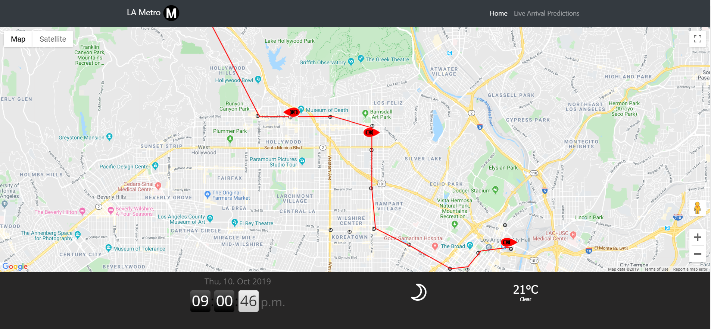

# LA-Metro-Tracker

First of all, this project is a work in progress which I plan to finish in the summer break of 2019.

If you want the google map to work, you will need to input an API key on line 54 of index.html

I wrote this website to teach myself about REST APIs. The website makes calls to the LA metro API and gets results returned in JSON and XML. I then plot these results on a google map to show the location and direction of trains in real-time.

